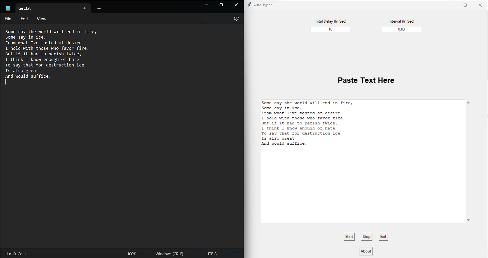

## AutoTyper

<p align = "center"></p>

A Minimalistic Terminal/Application Based Auto Typer with Custom Initial Delay, Text and Intervel

## Python Version

**Python 3**

## Prerequisite

```
pip install pyautogui
```

## Set-Up ⚒️

<p align = "center"></p>

- Ensure you have the latest stable version of [Python 3](https://www.python.org/downloads/) in your system

- Open your terminal / command prompt

- Clone the repository 
    ```
    git clone https://github.com/Julian-Idl/AutoTyper.git
    ```
- Change the directory to the cloned project
    
    ```
    cd AutoTyper
    ```

## Parameters

- delay - Initial delay provided so that you get time to navigate to the window where you want to auto type content.

- name - Full or relative path of input file.

- interval - Interval between each keystroke, this is provided so that software doesn't think you are a bot.(0.07 is optimum for Notepad RT V.2)

## Usage

**Command Line**

- Open `file.txt`, paste your content and save the file.

- Run the following command:
```
python autoTyper.py
```
- Click on the window/space for the autotyper to type the content.

**Graphical User Interface**
```
python autoTyperGUI.py
```

## Demo 👇

**v.0.0.1 (Graphical User Interface)**


<p align = "center"></p>


**v.0.0.1 (Graphical User Interface with sample text)**

<p align = "center"></p>

## Note ✏️

- If you wish to change the settings for terminal version, open `autoTyper.py` and meddle with *delay*, *name* and *interval* parameters.

- Feel free to contact me in my  [](https://julian-idl.codes)

## Author

Made with ♥ by [Julian-Idl](julian-idl.codes)